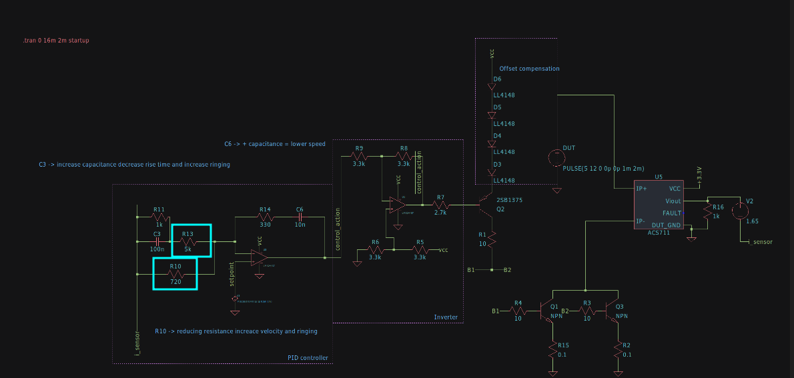
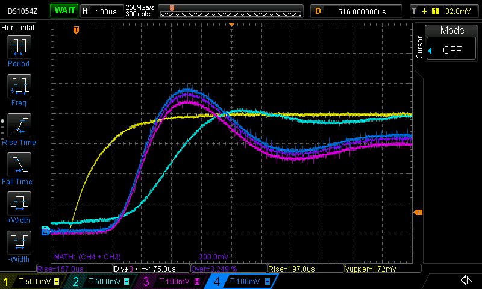
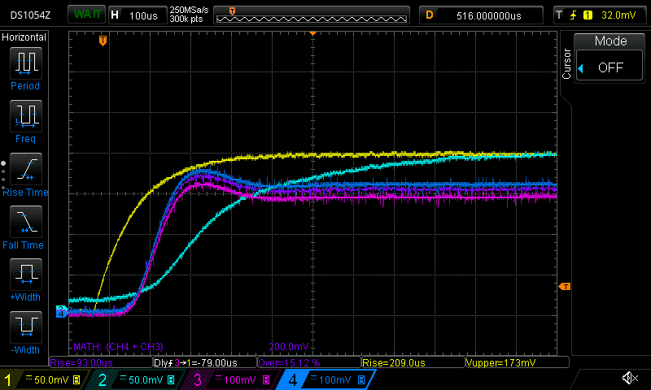
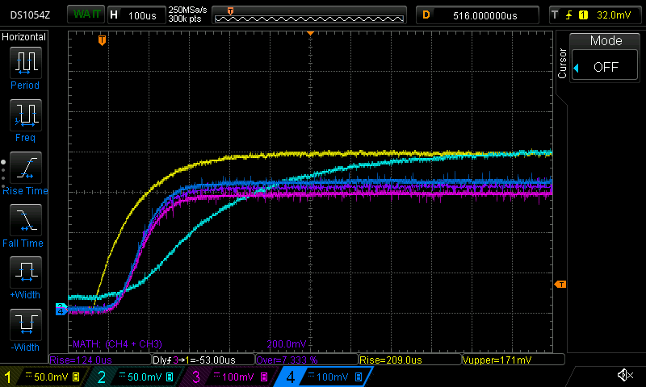
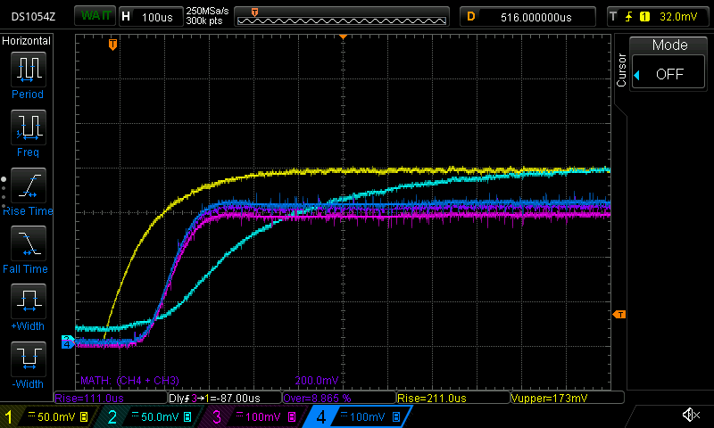
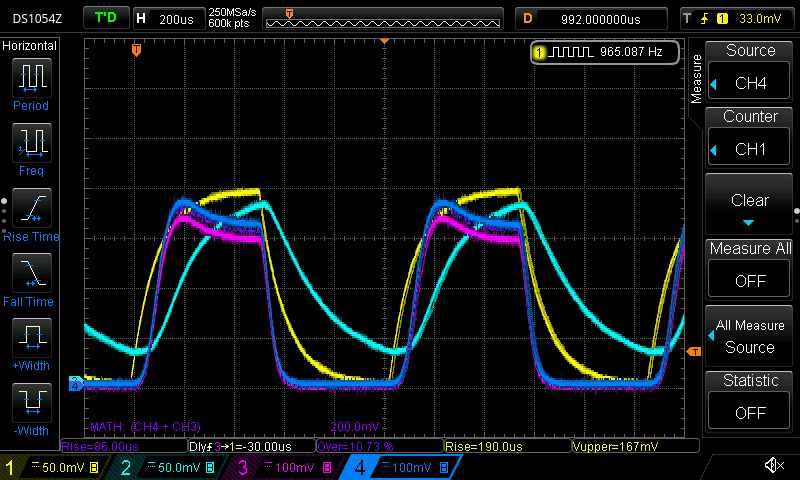
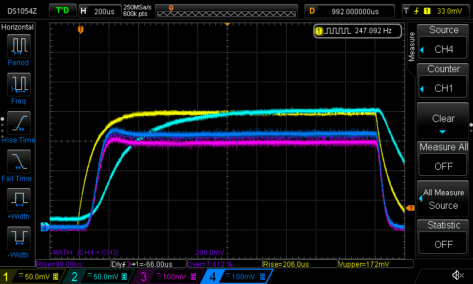

## Ajuste do Controlador Analógico

Para realizar o ajuste (tuning) do controlador analógico, foram colocados dois trimpots nos resistores R13 e R10, conforme mostrado na figura abaixo:

O valor de R10 foi ajustado inicialmente para obter a resposta mais rápida possível com uma leve oscilação. Em seguida, o valor de R13 foi modificado para reduzir essa oscilação.

### Respostas do Controlador no Osciloscópio

Abaixo estão algumas capturas do osciloscópio mostrando a resposta do controlador analógico com diferentes ajustes dos trimpots:

- Resposta com tempo de subida rápido mas com maior oscilação:
  
  

- Resposta com tempo de subida médio e oscilação moderada:
  
  

- Resposta com tempo de subida lento e oscilação mínima:
  
  

**Legenda dos canais no osciloscópio:**
- Canal amarelo: setpoint
- Canal azul claro: saída do sensor de corrente
- Canal azul escuro e roxo: corrente em cada transistor

A melhor resposta foi obtida com os valores de **R10 = 2k7** e **R13 = 250R**, resultando em um atraso de resposta de 97 µs e um tempo de subida de 111 µs, significativamente mais rápido que o desejado (2 Hz).

### Resposta do Controlador em Condições de Estresse

Abaixo estão as capturas do osciloscópio com o controlador analógico sob estresse, usando a frequência máxima do DAC para gerar o setpoint.

Como pode ser visto na imagem acima, o controlador consegue manter aproximadamente **955 Hz** de forma satisfatória.

Abaixo está a resposta do controlador analógico operando a 250 Hz.

