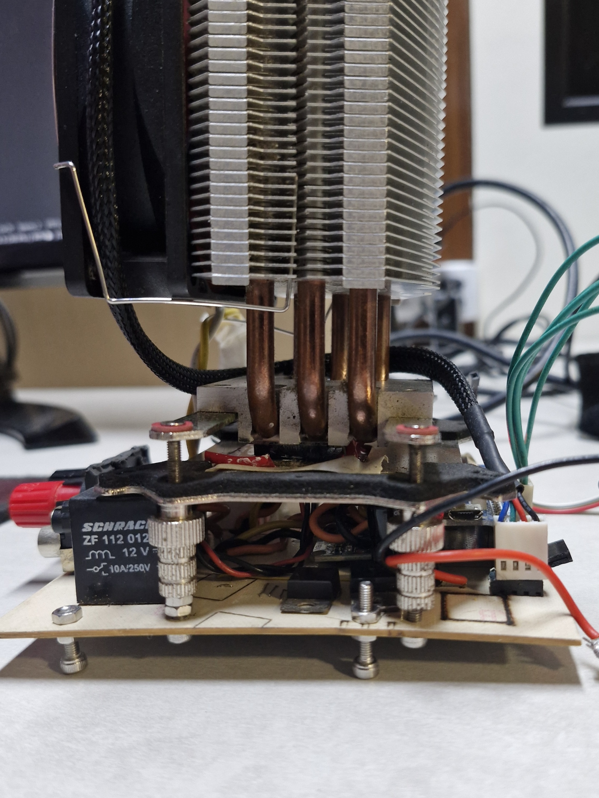

# Montagem Final

## Introdução
Nesta etapa final, toda a estrutura de hardware foi consolidada com foco na comunicação entre a placa de carga (Load) e o painel de controle (Panel). Devido a um bug em modo **slave** descrito na *errata* do STM32F10xx8/STM32F10xxB, optou-se por realizar a comunicação via **UART**, garantindo estabilidade e confiabilidade no envio e recebimento de dados.

## Comunicação via UART
- **Motivo da Mudança**: O microcontrolador STM32 apresentou inconsistências no protocolo I2C em modo *slave*, reportadas na errata *STM32F10xx8 STM32F10xxB Errata Sheet*.
- **Estrutura de Dados**: A transmissão e recepção via UART seguem um protocolo binário com o formato:
  - `[MAGIC_WORD, DATA, CRC]`
  - A seção `DATA` contém sempre a mesma estrutura para o TX e outra para o RX, porém com finalidades diferentes:
    - **Load -> Panel**: Envia leituras de tensão, corrente, temperatura e demais medições do sistema.
    - **Panel -> Load**: Envia comandos de configuração (modo de operação, valores de corrente, tensão, etc.) e de controle (habilitar/desabilitar carga).
- **Implementação**: A comunicação UART se dá em nível lógico compatível com o microcontrolador, sendo necessário um cabo com conectores KK para interligar a placa da carga e o painel.

## Montagem dos Transistores no Dissipador
Para lidar com a dissipação de calor gerada pelos transistores de potência, foi montado um *stack* de refrigeração:
1. **Transistor**: Fixado ao dissipador por meio de uma estrutura de aço (frame) e parafusos.
2. **Sensor de Temperatura**: Entre o frame de aço e o transistor, posiciona-se a placa do sensor de temperatura, permitindo leituras próximas ao componente principal de aquecimento.
3. **Dissipador com Cooler**: O dissipador utilizado é um comercial de CPU, dotado de ventilador para refrigeração ativa. Ele é conectado à placa da carga, que controla a velocidade do cooler conforme a temperatura.

> *Figura 1: Ilustra a disposição dos componentes no *stack* térmico.*

> *Figura 2: Ilustra a disposição dos componentes no *stack* térmico* na foto real.*

## Fixação na Placa de Controle
- A pilha de dissipador + transistores + sensor de temperatura é aparafusada à placa de controle, garantindo estabilidade mecânica e facilidade de manutenção.
- Parafusos e porcas adicionais fixam o conjunto de forma segura, evitando vibrações ou desalinhamentos que poderiam prejudicar a medição de temperatura ou a eficiência do dissipador.

## Conectores Banana
Foram adicionados **conectores banana** nos pontos de entrada/saída de corrente e tensão. Isso facilita a conexão rápida e segura de cabos de teste, além de permitir medições e mudanças de bancada sem a necessidade de soluções improvisadas.

## Cabo de Conexão do Painel
- A comunicação entre a placa da carga e o painel se dá por um cabo com dois conectores KK, por onde são levados **alimentação** e **dados** (UART).
- Esse design modular permite desconectar o painel com facilidade. Dessa forma, é possível:
  1. Conectar um **conversor USB-Serial** diretamente na placa de carga para realizar testes, enviar firmware ou receber dados via PC.
  2. Utilizar a **SDK em Python** ou a **UI Python** para monitoramento e controle do sistema.