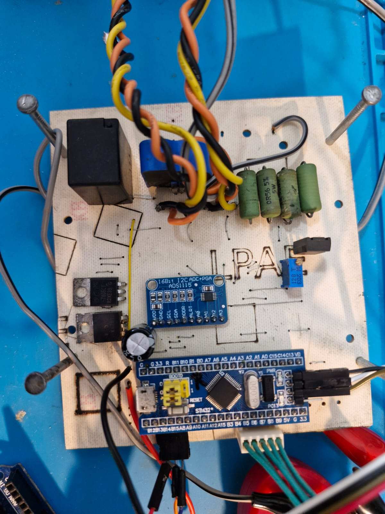
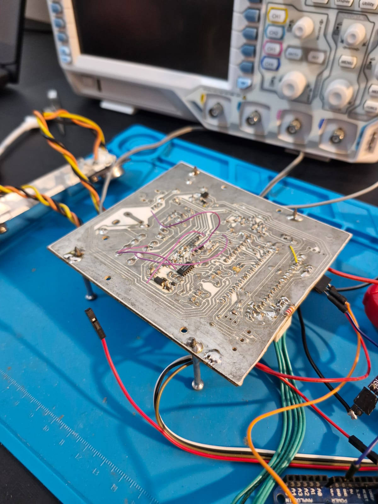
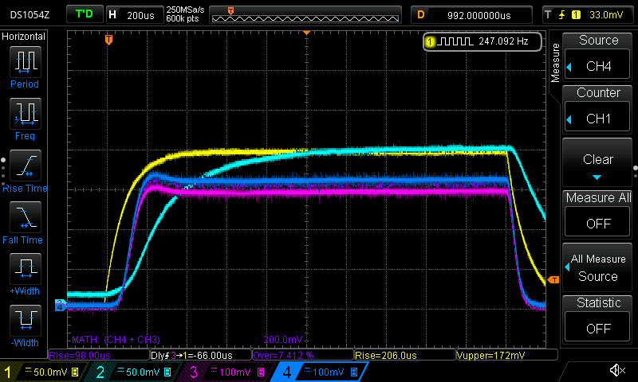
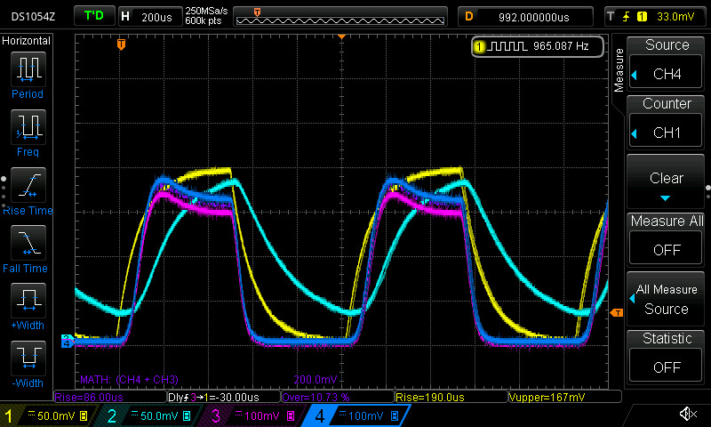

# Montagem da Placa da Carga

## Introdução

A montagem da placa de carga foi realizada como parte do desenvolvimento de um sistema para controle e monitoramento de carga. O processo incluiu a solda de componentes, validação de funcionamento e ajustes no hardware para garantir a precisão e estabilidade do sistema.

## Metodologia de Montagem

A montagem foi guiada pelo **IBOM (Interactive Bill of Materials)** gerado no KiCAD, o que facilitou a identificação e posicionamento correto de cada componente na placa.

O IBOM pode ser localizado [aqui](../hardware/load/output/ibom.html).

### Passos Realizados:
1. Soldagem inicial de todos os componentes, com atenção à polaridade e orientação especificadas no IBOM.
2. Verificação de conexões críticas e continuidade usando ferramentas de medição.
3. Ajustes manuais e correções em componentes conforme necessário.

## Testes

### Verificação da Montagem
- Após soldar todos os componentes, os jumpers foram mantidos desligados para evitar curtos indesejados durante os testes iniciais.
- Alimentação da placa:
  - Sequência de ligação dos jumpers: `input`, `5V`, e `3.3V`.
  - Verificação das tensões em pontos específicos para confirmar o funcionamento dos reguladores.
- Testes dos módulos:
  - **Microcontrolador:** Funcionamento verificado após alimentação.
  - **Sensor de Corrente:** Testado para garantir leituras consistentes.
  - **ADC e DAC:** Validação completa para confirmar a conversão de sinais.

### Tuning do PID Analógico
- Trimpots foram adicionados para ajustar manualmente os ganhos do controlador PID.
- Testes de resposta no osciloscópio foram realizados para otimizar a estabilidade e a eficiência do sistema.

### Teste de Linearização do ADC
- Realizada uma varredura em passos de 10 mV no DAC.
- Corrente exigida pela carga foi medida com um alicate amperímetro, comparando com os valores obtidos pelo ADC.
- Ajustes realizados usando uma regressão linear, atingindo precisão de 97%.

## Modificações na Placa

Durante o processo, algumas modificações foram necessárias:
1. **Sensor de Corrente:** 
   - O componente na biblioteca do KiCAD estava invertido.
   - Foi necessário cortar a trilha e adicionar um fio para corrigir o sentido.
2. **Relé:** 
   - A trilha de `enable` do relé foi desconectada.
   - Um fio foi adicionado para ligar o `enable` entre o microcontrolador e o transistor de drive.
3. **Estabilização do Transistor:**
   - Resistores de estabilização foram aumentados, melhorando a estabilidade em troca de um leve aumento na tensão mínima de operação.
4. **Transistores de Potência:**
   - Utilizados temporariamente os transistores **2N3773**, devido à indisponibilidade dos projetados.

## Conclusão

A montagem da placa e os testes realizados validaram a funcionalidade básica do sistema. Os ajustes no PID e a linearização do ADC garantiram alta precisão nos resultados, embora algumas melhorias ainda possam ser implementadas nas próximas iterações do projeto.
