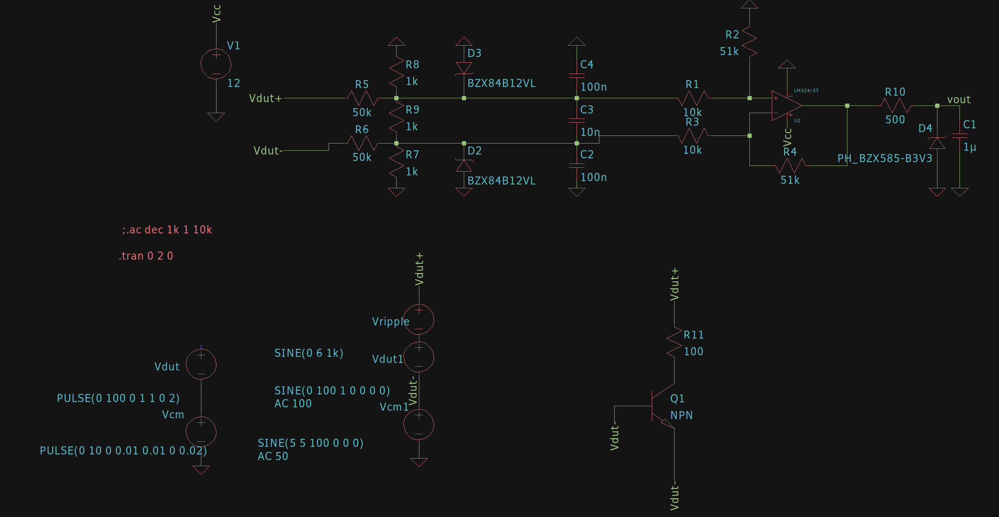

# Seção Analógica

## Correção de Offset

Os diodos na seção de correção de offset têm a função de compensar o fato de que o amplificador LM324 não é do tipo rail-to-rail, ou seja, ele não consegue atingir os 12V necessários para despolarizar completamente o transistor PNP Q2. Assim, foram utilizados diodos em série para que a queda de tensão neles crie um offset no emissor, garantindo uma operação correta.

## Controle Analógico

O controle analógico da carga eletrônica é composto por duas etapas principais:

1. **Inversor de Sinal**  
   Esta etapa consiste em um inversor para compensar o fato de que o driver com transistor PNP inverte o sinal. Pela natureza do circuito, com 12V não haverá passagem de corrente pelo transistor PNP, enquanto com 0V haverá a corrente máxima. Após a inversão, com 0V não haverá corrente, e o aumento da corrente será proporcional à tensão de entrada.

2. **Controlador PID Analógico**  
   A segunda etapa é um controlador PID analógico feito com um amplificador operacional (ampop). Esse controlador é interessante porque, caso seja necessário desativá-lo para utilizar apenas o controle digital, basta colocar um curto em R14 e C6.

   O cálculo do controlador foi feito através de um método empírico de sucessivas aproximações, onde, utilizando o LTSpice, foram ajustados os valores de capacitância e resistência até atingir o comportamento desejado. É importante ressaltar que sempre há uma diferença entre simulação e prática; portanto, quando implementado em bancada, será realizado um ajuste fino dos componentes.

   - **Capacitor C3**: Aumentar a capacitância de C3 reduz o tempo de subida (rise time), mas também aumenta o fenômeno de ringing (oscilações com overshoot). Valores excessivos podem causar instabilidade.
   - **Resistor R10**: Reduzir a resistência de R10 aumenta a velocidade do circuito, mas também eleva o ringing.
   - **Capacitor C6**: Controla a velocidade de resposta do controlador. Quanto maior a capacitância, mais lenta será a resposta.

   Os resistores em série com os capacitores têm uma função equivalente à variação direta da capacitância dos capacitores associados.

### Valores Encontrados

Após a variação dos componentes em simulação e ajuste, os valores que atendem às necessidades do projeto são:

- **R14**: 330Ω
- **C6**: 10nF
- **R10**: 720Ω
- **C3**: 100nF
- **R13**: 5kΩ
- **R11**: 1kΩ

### Simulação

	

	

### Observações
A resposta do controlador PID analógico é satisfatória para o projeto, tendo um leve overshoot e settling time aceitável. Ainda assim, é importante ressaltar que a implementação prática pode apresentar diferenças em relação à simulação, e ajustes finos podem ser necessários.

## Sensor de Tensão

A configuração do sensor de tensão consiste em um divisor de tensão simétrico com redução de modo comum, conectado a um amplificador operacional em modo diferencial.

### Divisor de Tensão

O divisor de tensão é composto por tres etapas acopladas:

1. **Divisor de Tensão de Modo Comum**: Os resistores conectados ao GND, em conjunto com os resistores em série com a entrada, servem como um divisor de tensão para o modo comum.

2. **Divisor de Tensão Diferencial**: Um resistor que conecta os resistores do divisor em série com a entrada funciona como um divisor diferencial. Este divisor é configurado de forma simétrica para maximizar a redução de ruído de modo comum pelo amplificador operacional.

Para o cálculo dos valores desses divisores, foi utilizado o método empírico de sucessivas aproximações até que os valores atendessem às necessidades do projeto.

### Amplificador Operacional em Modo Diferencial

O amplificador operacional diferencial é usado nesta configuração porque a entrada terá um offset de tensão devido às quedas de tensão nos fios e trilhas quando houver passagem de corrente pela carga. O ganho foi ajustado para que, com uma entrada de 120V no divisor de tensão, a saída forneça 3.3V, aproveitando todo o range do ADC.

### Filtros

Existem 3 etapas de filtro passa-baixa no circuito, 2 na entrada que são responsáveis por reduzir o ruido de modo comum e diferencial que entram no amplificador operacional e 1 na saída que é responsável por reduzir o ruido de saida do amplificador operacional.Todos os filtros foram calculados para ter uma frequência de corte aproximada de 1kHz.

### Proteções

O circuito conta com proteções contra sobretensão e tensão reversa, tanto na entrada quanto na saída. A proteção de sobretensão é feita por diodos tvs.

### Valores Encontrados
R5 = R6 = 50kΩ
R7 = R8 = R9 = 1kΩ
C2 = C4 = 100nF
C3 = 10nF
R10 = 500Ω
C1 = 1uF

### Simulação

	

	

# Seção de Potência

## Polarização do Transistor de Potência e Driver
Para determinar os valores dos resistores de base dos transistores de potência, foi utilizado o método de sucessivas aproximações, buscando um ponto de operação onde o transistor tenha corrente de base suficiente para entrar em saturação. Após encontrar esse ponto, o valor do resistor foi ainda reduzido para garantir que, na condição de corrente máxima, o driver possa fornecer corrente suficiente para que o transistor conduza o necessário.

Para determinar o resistor de emissor foi calculado o maior resistor que garantisse que vai existir corrente suficiente para tensões de entrada baixas (>2V)

### Valores Encontrados
Resistor da base: 20Ω
Resistor da base do driver: 2.2kΩ
Resistor do emissor: 0.1Ω

## Cálculo da Resistência Térmica Máxima do Dissipador

Para determinar a resistência térmica máxima do dissipador necessário para dissipar uma potência total de 100W distribuída entre dois transistores, com aplicação direta de pasta térmica, foram consideradas as seguintes especificações:

- **Resistência térmica junction-to-case (Rθjc)** de cada transistor: 1.25 °C/W
- **Temperatura ambiente máxima**: 30 °C
- **Temperatura máxima de operação dos transistores**: 120 °C

### Passo a Passo do Cálculo

1. **Cálculo do aumento de temperatura permitido ($\Delta T$)**:  
   $$
   \Delta T = T_{max} - T_{amb} = 120 \,°C - 30 \,°C = 90 \,°C
   $$

2. **Distribuição da Potência**: Cada transistor dissipará metade da potência total, ou seja, 50W por transistor.

3. **Resistência Térmica Junction-to-Case Total**:  
   Para cada transistor, a queda de temperatura da junção até a case será:
   $$
   R_{\theta jc} \times P = 1.25 \,°C/W \times 50 \,W = 62.5 \,°C
   $$
   Como são dois transistores, o aumento total na temperatura da junção para a case será de 62.5 °C em cada transistor.

4. **Resistência Térmica Necessária para o Dissipador ($R_{\theta sa}$)**:  
   A resistência térmica do dissipador (case-to-ambient) precisa dissipar o restante da queda de temperatura, que é:
   $$
   R_{\theta sa} = \frac{\Delta T - (R_{\theta jc} \times P)}{P_{total}}
   $$
   $$
   R_{\theta sa} = \frac{90 \,°C - 62.5 \,°C}{100 \,W} = \frac{27.5 \,°C}{100 \,W} = 0.275 \,°C/W
   $$

Portanto, para manter a temperatura dos transistores abaixo de 120 °C, a resistência térmica máxima do dissipador deve ser **0.275 °C/W**.

