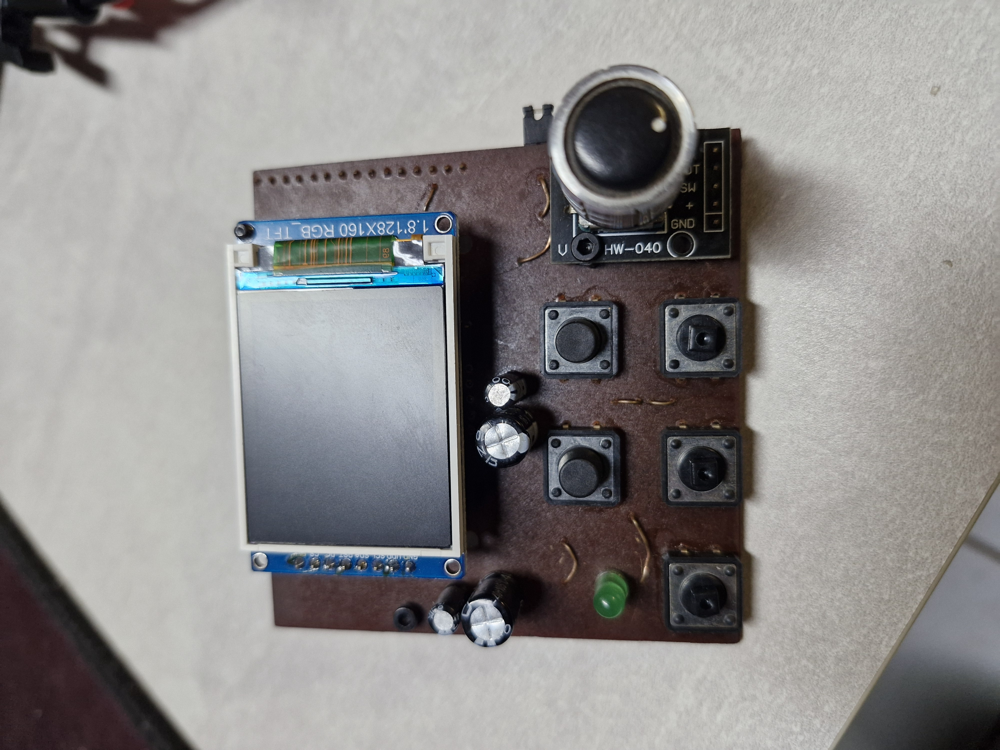
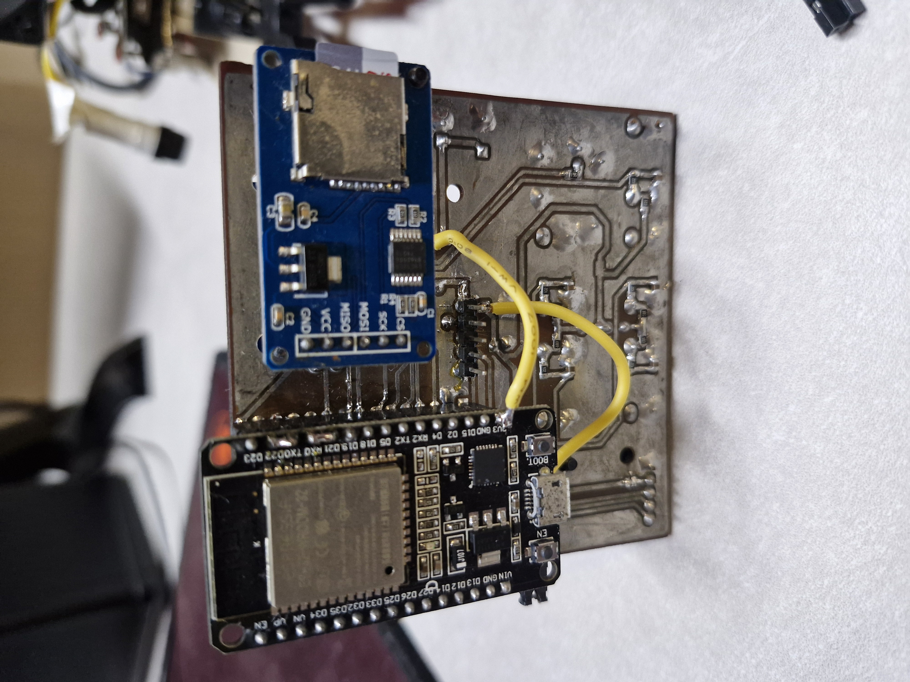

# Montagem do Painel de Controle

## Introdução
O painel de controle é responsável por enviar comandos à carga por meio do protocolo UART. Ele conta com um display TFT ST7735 de 160x128, cinco botões (quatro para seleção de modos – CC, CV, CR, CP – e um para **enable**), além de um encoder para ajuste de valores e um botão embutido no encoder para alternar **cursor/menu**.

Este documento descreve o processo de fabricação e montagem do painel, incluindo a confecção da placa por corrosão química, a solda de componentes THT e SMD, bem como as adaptações necessárias para o correto funcionamento em UART.

## Metodologia de Montagem

### Confecção da PCB
- **Método de Transferência Térmica:** Foi utilizada a impressão do layout em papel *glossy* e, em seguida, a transferência para a placa virgem por meio de uma prensa térmica.
- **Corrosão com Percloreto de Ferro:** Após a transferência do layout, a placa foi mergulhada em percloreto de ferro para corrosão das áreas expostas de cobre, formando as trilhas.
- **Limpeza e Acabamento:** Concluída a corrosão, foi feita a limpeza química para remoção dos resíduos de percloreto, seguida de furação (nos furos de THT) e preparação para solda.

### Montagem dos Componentes
1. **Solda de SMD:** Os componentes SMD foram soldados primeiramente.
2. **Solda de THT:** Posteriormente, foram soldados os componentes de montagem radial ou axial (THT), como conectores, botões, soquetes e o encoder.

> *Figura 1: Vista frontal do Painel de Controle, mostrando o display e os botões.*

> *Figura 2: Vista traseira do Painel de Controle, onde é possível observar o ESP e os jumpers adicionados.*

## Testes

### Alimentação e Conectividade
- Antes de energizar o painel, foram verificadas continuidades e possíveis curtos em trilhas e componentes sensíveis.
- Alimentou-se o circuito de forma gradual, monitorando a fonte de alimentação e checando se o display inicializava corretamente.

### Comunicação UART
- Após constatar que o painel precisa se comunicar com a carga via UART (ao invés de I2C), a adaptação dos pinos foi realizada.
- Fez-se a leitura dos dados transmitidos pelo microcontrolador com auxílio de um conversor USB-UART, confirmando a troca de informações entre painel e carga.

### Funcionamento dos Botões e Encoder
- Os cinco botões (quatro de modo e um de enable) foram testados para garantir a correta detecção de cada evento (pressionado/solto).
- O encoder foi girado em ambos os sentidos, e seu botão foi pressionado para confirmar o seu funcionamento.

## Ajustes e Modificações Realizados

1. **Mudança de Pinos (I2C para UART):**
   - Foi necessário soldar um *jumper* do **GPIO1** para o **GPIO22** e do **GPIO21** para o **GPIO3**, convertendo a função de I2C para UART é possivel observar na figura 2.
     - *Justificativa:* Esses pinos, originalmente reservados para o barramento I2C, precisaram ser remapeados para UART a fim de estabelecer a comunicação com a placa de carga.

2. **Jumper para Botões:**
   - Criou-se um *jumper* adicional que permite desconectar fisicamente os botões do microcontrolador.
   - *Motivo:* Durante a gravação do firmware no microcontrolador, os botões podem interferir no processo. Deixá-los em aberto garante que a programação seja feita sem conflitos de pinos.

## Conclusão
A confecção do painel de controle por corrosão térmica e o subsequente processo de soldagem THT/SMD resultaram em um módulo funcional para interação com a carga via UART. Os ajustes de pinos (de I2C para UART) e a adição de jumpers para permitir a gravação do microcontrolador foram fundamentais para o sucesso da montagem.

Com esse painel, é possível selecionar os modos de operação (CC, CV, CR, CP), habilitar ou desabilitar a carga e ajustar parâmetros via encoder, tornando o sistema completo para testes e controle de cargas em diferentes cenários de aplicação.

